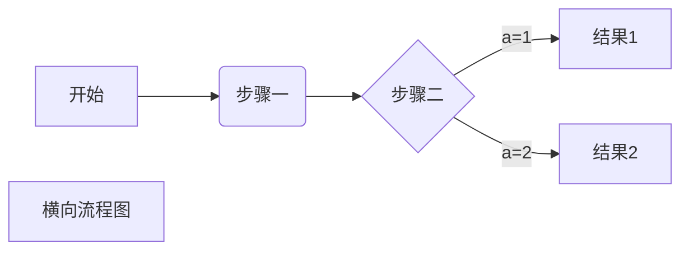
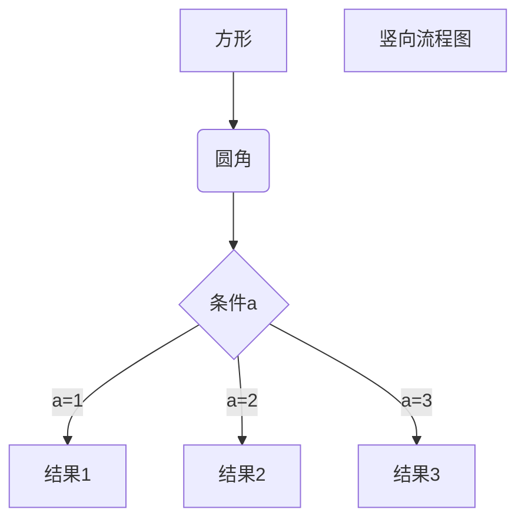

# 一级标题
## 二级标题
hello world!
``` C++
    using namespace std;
    void swap(int& a,int&b){
        int tmp = a;
        a = b;
        b = tmp; 
    }
    int main(){
        std::cout << "Hello, world!" << std::endl;
    }
```
> 这是一条引用
> > 再加条引用
* 第一项
* 第二项
  1. 这是分论点一
        - 这是一句话
  2. 这是分论点二
        > 引用1
        > 引用2
   
*斜体字* _xietizi_

**粗体字** __cutizi__

***粗斜体字*** ___cuxietizi___

<u> 下划线 </u>

~~删除这句话~~


***

创建一个脚注 [^1] 。

[^1]:你好代表着向别人问好

创建脚注格式类似这样 [^RUNOOB]。

[^RUNOOB]: 菜鸟教程 -- 学的不仅是技术，更是梦想！！！

学习一个c++函数：

`int add(int a, int b)`:
```C++
int add(int a,int b){
    return a+b;
}
```
    int add(int a,int b){
        return a+b;
    }

这是一个链接 [菜鸟教程](https://www.runoob.com)

这个链接用 1 作为网址变量 [Google][1]
这个链接用 runoob 作为网址变量 [Runoob][runoob]
然后在文档的结尾为变量赋值（网址）

  [1]: http://www.google.com/
  [runoob]: http://www.runoob.com/

| 左对齐 | 右对齐 | 居中对齐 |
| :-----| ----: | :----: |
| 单元格 111111| 单元格 1111| 单元格1111 |
| 单元格 | 单元格 | 单元格 |

$f(x)=sinx +cosx$

$$\sum_{n=1}^{100} (n^2+n)$$

$$
\begin{bmatrix}
   a & b \\
   c & d
\end{bmatrix}
$$
$$
\begin{CD}
   A @>a>> B \\
@VbVV @AAcA \\
   C @= D
\end{CD}
$$




```flow
st=>start: 开始框
op=>operation: 处理框
cond=>condition: 判断框(是或否?)
sub1=>subroutine: 子流程
op2=>operation: 处理框
io=>inputoutput: 输入输出框
e=>end: 结束框
st->op->cond
cond(yes)->io->e
cond(no)->sub1(right)->op2->op
```

```flow
st=>start: 开始框
op=>operation: 处理框
cond=>condition: 判断框(是或否?)
sub1=>subroutine: 子流程
io=>inputoutput: 输入输出框
e=>end: 结束框
st(right)->op(right)->cond
cond(yes)->io(bottom)->e
cond(no)->sub1(right)->op
```
